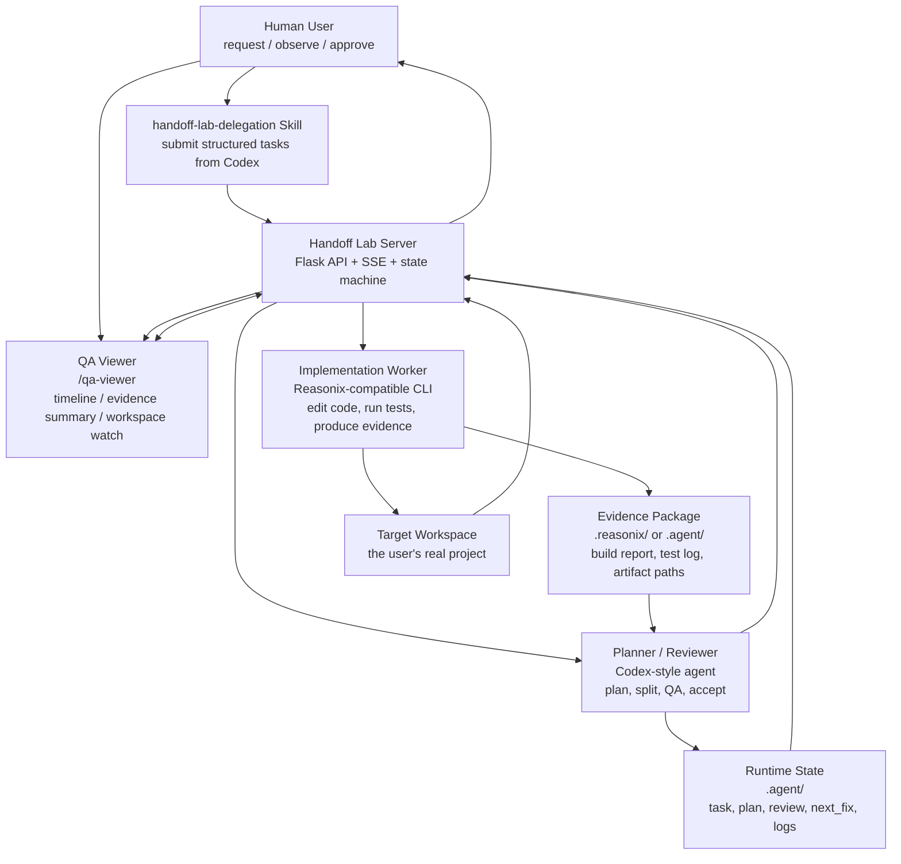

# Handoff Lab

[中文说明](README.zh-CN.md) · [Project Introduction](docs/project-introduction.zh-CN.md) · [Architecture Preview](docs/architecture-diagrams.html)

Local planner-worker delegation bridge for AI coding agents.

Handoff Lab lets one agent act as planner/reviewer while a separate worker
agent performs implementation, runs commands, and returns concise evidence.
The default local workflow supports a Codex-style planner/reviewer and a
Reasonix-style implementation worker, but the project name and package avoid
claiming official affiliation with either provider.

See [NOTICE.md](NOTICE.md) for trademark and affiliation notes.

## Architecture



## Technical Highlights

- **Planner / worker separation**: the planner reviews, designs acceptance
  criteria, and judges evidence; the worker edits code, runs commands, and
  produces artifacts.
- **Evidence-first review**: Handoff Lab treats build reports, test logs, diffs,
  generated files, previews, and screenshots as review inputs. Claims alone are
  not enough.
- **Real worker transport gate**: the delegation skill must use a real local
  bridge, worker CLI, or explicit adapter. A generic Codex subagent is not
  accepted as a worker substitute.
- **Concise process visibility**: `/qa-viewer` shows lifecycle events,
  summaries, and evidence paths without flooding the browser with full CLI logs.
- **Codex QA profile**: reviews stay machine-readable as JSON, while optional
  7-section Markdown guidance gives the worker precise next-round repair
  instructions.
- **Long-context worker strategy**: large-context workers receive structured
  packets instead of raw repository dumps: request, constraints, relevant files,
  tests, acceptance criteria, prior failures, and required evidence.
- **Failure escape hatch**: if the worker fails the same review finding three
  consecutive times, Codex can perform one temporary fallback implementation
  pass for that task, then return to the normal worker path.

## What It Does

- Shows a focused process viewer at `/qa-viewer`.
- Redirects `/` to `/qa-viewer`; the open-source build does not expose the
  earlier experimental main console as a product entry.
- Stores all runtime state under `.agent/` and `.reasonix/`.
- Supports local authorization modes exposed in `/qa-viewer`: ask, automatic
  allow, and YOLO trust. The legacy `deny` API mode is still accepted for
  adapters, but it is not shown as a primary UI action.
- Lets a Codex skill submit structured implementation packets to the local
  bridge instead of spawning a generic coding subagent.
- Uses a Codex QA review profile inspired by the standalone `codex-qa` workflow:
  Codex still stays read-only during review, but can return both compact JSON
  and a 7-section Markdown guidance block for the next worker round.
- Keeps worker output concise in the UI while preserving evidence paths.
- If the worker fails the same Codex review finding three consecutive times,
  Codex performs one temporary fallback implementation pass for that task, then
  the loop returns to the normal worker path if more work remains.

## Requirements

- Windows, macOS, or Linux with Python 3.11+.
- `codex` CLI installed and logged in if you use Codex as planner/reviewer.
- `reasonix` CLI installed if you use the Reasonix worker transport.
- Optional DeepSeek-compatible API credentials for dialogue/API features.

Install Python dependencies:

```powershell
python -m venv .venv
.\.venv\Scripts\Activate.ps1
python -m pip install -r requirements.txt
```

## Configuration

Copy [.env.example](.env.example) for reference, then set environment variables
in your shell or launcher. Do not commit real credentials.

Important variables:

- `HANDOFF_LAB_HOST`: bind host, default `127.0.0.1`.
- `HANDOFF_LAB_PORT`: bind port, default `51514`.
- `HANDOFF_LAB_URL`: optional client/skill target URL, for example
  `http://127.0.0.1:51515`. Use it when multiple Handoff Lab services are
  running or when the service is not on the default port.
- `DEEPSEEK_API_KEY`: optional API key for DeepSeek-compatible calls.
- `DEEPSEEK_BASE_URL`: optional base URL, default `https://api.deepseek.com`.
- `REASONIX_MODEL`: worker model name, default `deepseek-v4-pro`.
- `CODEX_CLI`: optional Codex executable override, default `codex`.
- `REASONIX_CLI`: optional worker executable override, default `reasonix`.
- `OPENAI_PROFILE`, `OPENAI_MODEL`, `OPENAI_REASONING`: optional Codex controls.
- `VISION_PROVIDER`, `VISION_BASE_URL`, `VISION_MODEL`, `VISION_API_KEY`:
  optional visual QA model settings. The default visual endpoint shape is
  OpenAI-compatible, with `VISION_BASE_URL=https://api.xiaomimimo.com/v1` and
  `VISION_MODEL=mimo-v2.5`.

The repository also includes [config.example.json](config.example.json) as a
shape reference for GUI or adapter configuration. Runtime secrets should still
come from environment variables or local `.agent/model_config.json`, not from a
tracked JSON file.

## Start

```powershell
python server.py
```

Then open [http://127.0.0.1:51514/qa-viewer](http://127.0.0.1:51514/qa-viewer).
Opening [http://127.0.0.1:51514/](http://127.0.0.1:51514/) redirects to the
same viewer.

The viewer includes the local controls needed for the open-source workflow:

- CLI authorization: ask, automatic allow, or YOLO trust.
- Model configuration: DeepSeek/Reasonix worker settings, Codex CLI controls,
  and visual model settings.
- Connection tests for DeepSeek, Codex, and the visual model.

When the delegation skill hits an ask-mode authorization gate, `/qa-viewer`
shows a pending authorization dialog. Approving it lets the skill continue
without asking the Codex conversation to manually retry.

On Windows you can also double-click:

```text
start_51514_qa_viewer.bat
```

On macOS/Linux:

```bash
sh ./start_handoff_lab.sh
```

To use another port:

```powershell
$env:HANDOFF_LAB_PORT = "51515"
python server.py
```

If you start the service on a non-default port, point the delegation skill at
the same service:

```powershell
$env:HANDOFF_LAB_URL = "http://127.0.0.1:51515"
```

The skill can auto-discover local services on common ports when `/api/health`
is available. If multiple services are running and none clearly matches the
target workspace, it fails fast and asks for `HANDOFF_LAB_URL` or `--base-url`
instead of guessing.

## Install The Skill

The repo includes a neutral skill package at:

```text
skills/handoff-lab-delegation
```

Install it into your Codex skills directory:

```powershell
Copy-Item -Recurse -Force .\skills\handoff-lab-delegation $env:USERPROFILE\.codex\skills\
```

Then invoke it from another Codex conversation as:

```text
Use $handoff-lab-delegation for this task.
```

The skill must use a real Handoff Lab / Reasonix transport. It must not replace
the worker with a generic Codex subagent.

## Codex QA Profile

Handoff Lab does not embed a second QA server or a second viewer. Instead, it
adopts the useful parts of the `codex-qa` pattern as an internal review profile:

- Review JSON remains machine-readable: `status`, `risk_level`,
  `blocking_issues`, `non_blocking_issues`, `fix_instructions`, and `summary`.
- Reviews may also include optional `guidance_markdown`.
- `guidance_markdown` follows seven sections: conclusion, verified evidence,
  passed items, failed items, next development guidance, required evidence, and
  final boundaries.
- When changes are requested, Handoff Lab writes that guidance into
  `.agent/next_fix.md` so the worker receives complete repair instructions
  instead of only a terse bullet list.

## Smoke Test

Run focused tests:

```powershell
python -m pytest tests/test_start_direct_reasonix.py tests/test_qa_workspace_watch.py tests/test_qa_viewer_page.py -q
```

Run the broader Python test suite:

```powershell
python -m pytest -q
```

## Release Hygiene

Before publishing:

- Ensure `.agent/`, `.reasonix/`, logs, credentials, generated decks, and local
  artifacts are not tracked.
- Decide whether local handoff notes such as `HANDOFF.md` and historical
  planning notes under `docs/superpowers/` should be excluded from the public
  repository or rewritten as public documentation.
- Search for private absolute paths and secrets.
- Verify the server starts from a clean clone.
- Verify the included skill can submit a direct packet to `/api/start`.

## Security Notes

Handoff Lab is a local development tool. Do not expose it to an untrusted
network. The `yolo` mode allows the worker to execute commands with broad local
power; use it only in trusted workspaces.
