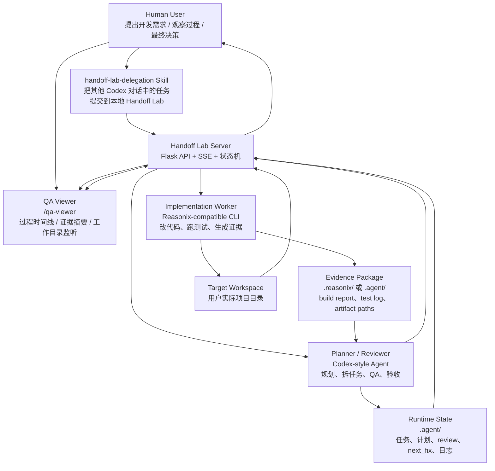
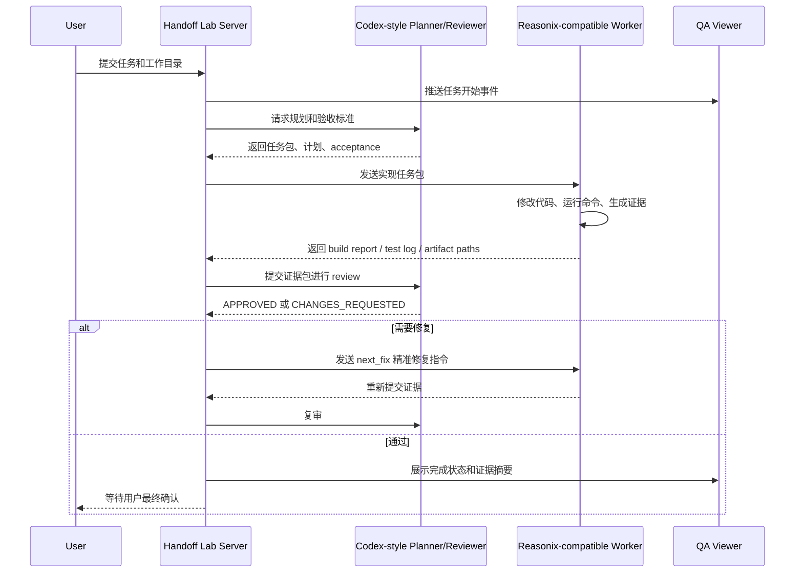

# Handoff Lab 项目介绍

## 一句话介绍

Handoff Lab 是一个面向 AI 编程代理的本地协作桥接工具：让一个模型负责规划、拆任务和验收，让另一个真实的执行代理负责改代码、跑命令、产证据，并把整个协作过程通过一个轻量的 Web 页面展示出来。

GitHub 主页：[https://github.com/wuxiulike](https://github.com/wuxiulike)

它解决的不是“再做一个聊天界面”，而是一个更实际的问题：当多个 AI 编程工具各有所长时，怎样让它们按工程流程协同，而不是各自说一堆、互相复述、最后没人真正交付。

## 为什么需要 Handoff Lab

当前 AI 编程工具已经非常强，但在真实开发流程里仍然有几个常见痛点：

- 规划模型很会拆需求和审查，但直接让它一直写代码，成本高。
- 执行模型或本地 CLI 可以跑命令、改文件，但复杂架构判断和验收能力不稳定。
- 多代理协作经常变成“互相复述”，缺少明确交接物和证据链。
- 用户想看过程，但不想被完整终端日志和模型思考过程淹没。
- 子代理、后台任务、CLI 输出和文件产物散落各处，最后很难判断到底完成了什么。

Handoff Lab 的设计目标，是把这些零散能力组织成一个可验证的本地流水线。

## 核心理念

Handoff Lab 采用“规划者 - 执行者 - 证据 - 验收”的协作模式。

- 规划者负责理解需求、拆分任务、定义验收标准。
- 执行者负责修改代码、运行命令、生成产物和测试日志。
- 系统负责保存任务状态、上下文、文件证据和过程事件。
- 验收者只根据真实证据做判断，而不是相信模型声明。
- 用户通过 `/qa-viewer` 观察过程、查看摘要和证据路径。

这让 AI 协作更接近真实工程团队的工作方式：不是“谁说得更像真的”，而是“谁交付了可检查的东西”。

## 技术架构图



## 工作流



## 技术架构

Handoff Lab 由五个核心层组成。

### 1. 本地服务层

`server.py` 提供本地 Flask 服务，默认运行在 `127.0.0.1:51514`。

它负责：

- 工作目录选择与会话状态管理。
- 任务启动、停止、轮次控制。
- 本地授权模式控制。
- SSE 事件流输出。
- 文件预览、历史对话、工作目录监听。
- 调用规划者和执行者。

开源版本只保留一个产品入口：`/qa-viewer`。这让项目定位更清晰：它不是一个泛聊天产品，而是一个 AI 交接过程查看器和代理协作桥。

### 2. 代理编排层

`tools/ai_flow.py` 是核心流水线编排器。

它负责把一次开发任务拆成几个阶段：

1. 初始化任务。
2. 生成 Codex 规划。
3. 调用执行 worker。
4. 收集测试日志和文件证据。
5. 调用 Codex review。
6. 根据结果进入下一轮修复或完成。

这个编排层的关键不是“让模型自由发挥”，而是把模型关进明确的工程协议里：输入是什么、输出是什么、证据在哪里、什么时候可以进入下一轮。

### 3. Worker 传输层

Handoff Lab 不把普通 Codex 子代理伪装成执行 worker。它要求任务必须通过真实 worker transport 进入执行路径。

当前支持的模式包括：

- 本地 Handoff Lab Web Bridge。
- 直接调用兼容的 worker CLI。
- 项目自定义适配器。

这条规则非常重要。它确保 Handoff Lab 的“委托”不是口头委托，而是可追踪、可落盘、可审查的真实执行链路。

### 4. QA Profile 层

项目内置 Codex QA Profile，用于让评审输出既适合机器判断，也适合下一轮执行。

Review JSON 保持机器可读：

- `status`
- `risk_level`
- `blocking_issues`
- `non_blocking_issues`
- `fix_instructions`
- `summary`

同时支持可选的 `guidance_markdown`，用于输出七段式开发指导：

1. 结论。
2. 我核验了什么。
3. 通过项。
4. 未通过项。
5. 下一步开发指导。
6. 下一轮需要提交的验收材料。
7. 边界提醒与最终判断。

当 Codex 要求修改时，Handoff Lab 会把这份指导写入 `.agent/next_fix.md`，让 worker 下一轮拿到清晰、完整、可执行的修复任务，而不是只看到几句零散反馈。

### 5. 可视化层

`templates/qa_viewer.html` 是独立过程查看器。

它通过 SSE 连接 `/stream`，展示：

- Codex 规划事件。
- Worker 执行摘要。
- Review 结果。
- 工作目录变化。
- 证据文件路径。
- 错误、停止、重试和完成状态。

Handoff Lab 不把所有 CLI 输出都塞进页面，而是强调“可读摘要 + 文件证据路径”。完整日志保留在工作目录中，需要深入排查时再打开。

## 技术亮点

### 1. Planner / Worker 职责隔离

很多多代理系统的问题，是所有模型都想当架构师，也都想写代码。Handoff Lab 反过来做：先把角色边界钉死。

- Planner 只做规划和验收。
- Worker 只做实现和自测。
- Review 只看证据。
- 用户保留最终判断权。

这种设计能显著减少模型互相复述、重复规划和跑题实现。

### 2. 证据优先，而不是声明优先

Handoff Lab 的 review 逻辑不会因为 worker 声称“测试通过”就直接通过。

它会关注：

- 是否有真实 test log。
- 是否有实际生成的 artifact。
- build report 和 git diff 是否一致。
- 视觉类任务是否有截图、渲染报告或预览文件。
- 是否存在样例文档硬编码。
- 是否污染了任务状态文件。

这让它更像一个 QA gate，而不是一个聊天总结器。

### 3. 精简过程展示

开发过程需要透明，但不应该把用户淹没。

Handoff Lab 的 `/qa-viewer` 采用“时间线 + 折叠详情”的方式，把模型过程、命令执行、证据路径和 review 结果整理成可阅读事件。

用户可以看到协作正在发生，也能知道产物在哪里，但不会被大段日志撑爆浏览器。

### 4. 本地优先，适合桌面 CLI 生态

Handoff Lab 默认运行在本机，适合 Windows、macOS 和 Linux 桌面开发环境。

它可以连接本地 CLI、读取本地工作目录、展示本地产物，并通过 `.agent/`、`.reasonix/` 保存运行状态。这种方式非常适合现阶段的 AI 编程工具生态，因为很多强工具本身就是 CLI 或桌面应用。

### 5. 长上下文 worker 的结构化使用

如果执行 worker 具备长上下文能力，Handoff Lab 不鼓励粗暴塞入整个仓库，而是生成结构化任务包：

- 原始需求。
- Codex 的解释和非目标。
- 相关架构摘要。
- 允许修改和禁止修改的文件。
- 必跑测试。
- 验收标准。
- 历史失败原因。
- 必须提交的证据。

这比“把全部上下文丢给模型”更稳定，也更节省 token。

### 6. 连续失败后的兜底机制

如果 worker 连续三次没有解决同一个 Codex review 问题，Handoff Lab 允许 Codex 临时兜底完成当前 task，然后再切回正常 worker 路径。

这不是让 Codex 重新接管全部开发，而是避免流水线在同一个小问题上无限空转。

## 适用场景

Handoff Lab 适合这些场景：

- 想用强模型做规划和验收，但希望降低实现阶段成本。
- 已经有本地 CLI 编程代理，希望给它加一个更严格的 QA 上游。
- 想观察两个 AI agent 的真实协作过程，而不是看假演示。
- 想在多轮自动修复里保留证据链和历史上下文。
- 想把 AI 编程流程做成可复盘、可调试、可开源的本地工具。

它不适合这些场景：

- 只想要一个普通聊天机器人。
- 不需要本地命令执行，也不关心工作目录证据。
- 希望模型完全自主修改生产环境。
- 不愿意配置本地 CLI 或 API。

## 与普通多代理框架的区别

Handoff Lab 的重点不是“创建更多 agent”，而是“让 agent 之间有交接协议”。

很多多代理 demo 看起来很热闹，但实际工程里最重要的是：

- 谁负责需求解释？
- 谁能改代码？
- 谁能运行命令？
- 谁负责验收？
- 验收看什么证据？
- 修复意见怎么传回执行者？
- 用户在哪里观察和打断？

Handoff Lab 把这些问题做成了明确的本地流程，而不是依赖模型临场自觉。

## 开源定位

Handoff Lab 是一个中立命名的开源基础项目。它不是 OpenAI、DeepSeek 或 Reasonix 的官方项目，也不声称与这些品牌存在官方关系。

项目的价值在于提供一个通用的本地代理协作模式：

- 上游可以是 Codex 风格的规划/验收代理。
- 下游可以是 Reasonix 兼容的执行 worker。
- 未来也可以接入其他 CLI、API 或本地代理。

换句话说，Handoff Lab 更像一个“AI 开发交接实验室”：它关心的不是某一个模型，而是模型之间怎样以工程方式协同。

## 项目结构概览

```text
Handoff_Lab/
├── server.py                         # 本地 Flask 服务和 SSE 事件流
├── tools/
│   ├── ai_flow.py                    # 规划-执行-测试-验收流水线
│   ├── codex_app_worker.py           # Codex app worker 会话适配
│   └── codex_qa_profile.py           # Codex QA profile 和 review guidance
├── templates/
│   └── qa_viewer.html                # 独立过程查看器
├── skills/
│   └── handoff-lab-delegation/       # 可安装到 Codex 的委托 skill
├── guards/
│   └── ambiguity_guard.py            # 模糊任务防护
├── tests/                            # 核心行为测试
├── .env.example                      # 环境变量样例
├── config.example.json               # 配置结构样例
├── README.md
├── README.zh-CN.md
├── NOTICE.md
└── LICENSE
```

## 未来方向

Handoff Lab 还可以继续增强：

- 支持更多 worker transport。
- 提供更标准的 evidence manifest。
- 将 QA Profile 抽象成可配置模板。
- 增强工作目录文件预览和 artifact 浏览。
- 增加任务队列和多 workspace 管理。
- 提供更完整的跨平台安装脚本。

这些方向的核心仍然不变：让 AI 编程代理的协作更透明、更可验证、更像真正的工程流程。

## 总结

Handoff Lab 的目标，是把 AI 编程从“单个模型的一次回答”推进到“多代理、有证据、可复盘的开发流水线”。

它让强模型负责判断，让执行模型负责落地，让系统保存证据，让用户看得见过程。

当 AI 编程工具越来越多，真正稀缺的不是再多一个 agent，而是一个可靠的交接机制。Handoff Lab 正是为这个交接机制而生。
